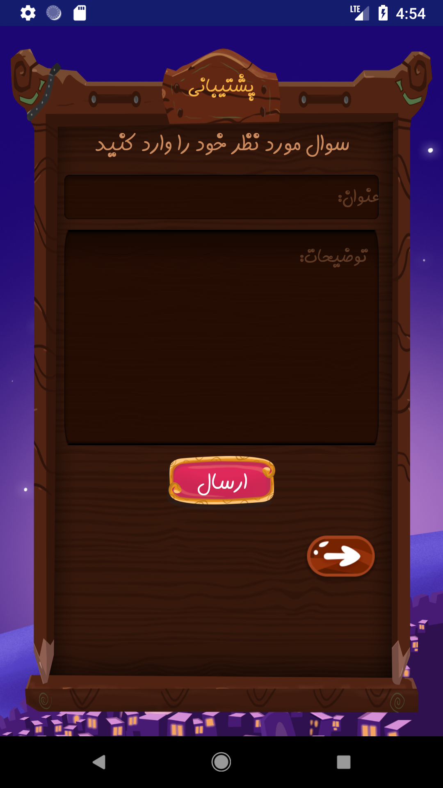
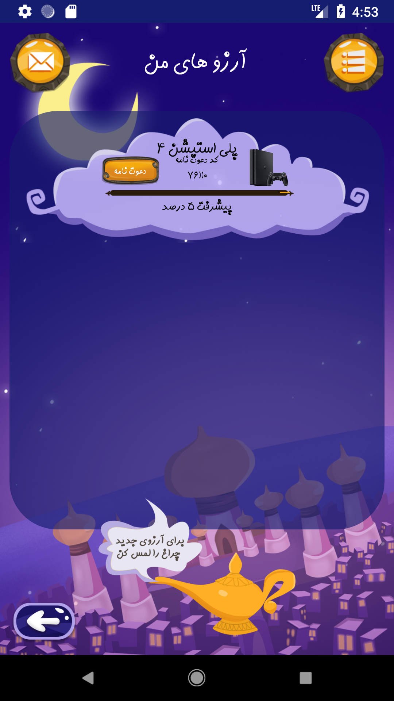
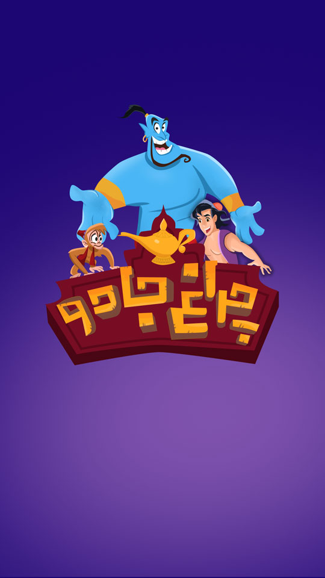

# 🎩 Alaedin iOS Game

## About the Project
**Alaedin Game** is an engaging mobile application where users can make wishes and earn points by inviting their friends. Inspired by the legend of Aladdin’s magical lamp, this game features a **pyramid-based scoring system** that rewards active participation.

## Features ✨
- **Developed with Swift** for iOS devices
- **Advanced computational algorithms** for user scoring management
- **Invite friends to earn more points**
- **Firebase integration** for data management
- **Modern UI and smooth animations**

## Prerequisites 📌
Before running the project, ensure you have the following tools installed:
- [Xcode](https://developer.apple.com/xcode/) (version 14+ recommended)
- [CocoaPods](https://cocoapods.org/) for dependency management
- A **Firebase** account to configure necessary services (set up the `GoogleService-Info.plist` file)

## Installation and Setup 🚀
### 1. Clone the Repository
```sh
git clone https://github.com/YourUsername/Alaedin-iOS.git
cd Alaedin-iOS
```

### 2. Install Dependencies
```sh
pod install
```

### 3. Open the Project in Xcode
```sh
open Alaedin.xcworkspace
```

### 4. Run on Simulator or Real Device
1. Select your desired device from Xcode’s menu.
2. Click **Run (⌘ + R)** to launch the application.

## Project Structure 📂
```
📂 Alaedin-iOS
 ┣ 📂 Alaedin
 ┃ ┣ 📂 Views        # UI screens and components
 ┃ ┣ 📂 Models       # Data models
 ┃ ┣ 📂 Controllers  # Business logic and controllers
 ┃ ┣ 📄 AppDelegate.swift  # Main application delegate
 ┃ ┣ 📄 Info.plist         # Application settings
 ┃ ┣ 📄 GoogleService-Info.plist  # Firebase configuration
 ┣ 📂 Pods           # Installed dependencies via CocoaPods
 ┣ 📄 Podfile        # Dependency management file
 ┣ 📄 README.md      # Project documentation
 ┗ 📄 .gitignore     # Ignored files in Git
```

## Project Dependencies 📦
- **Firebase SDK** (Authentication, Firestore)
- **CocoaPods** for dependency management
- **AVFoundation** for sound effects and media handling
- **UIKit** and **SwiftUI** for user interface

## Screenshots 📸
Here are some screenshots from the application:

### Home Screen


### Support Page


### My Wishes


### Main Menu


### Splash View


## Contribution Guide 👨‍💻
1. **Fork** the repository  
2. **Create a new feature branch:**  
   ```sh
   git checkout -b feature/your-feature
   ```
3. **Commit your changes:**  
   ```sh
   git commit -m "Added a new feature"
   ```
4. **Push to GitHub:**  
   ```sh
   git push origin feature/your-feature
   ```
5. **Submit a Pull Request** for review.

## Developers 💡
- 👤 **Developer Name 1** - [GitHub](https://github.com/yourprofile)
- 👤 **Developer Name 2** - [GitHub](https://github.com/yourprofile)

## License 📜
This project is licensed under the **MIT License**. [More Details](LICENSE).

---
🔥 **Make a wish in Alaedin and achieve your dreams!** 🌟
