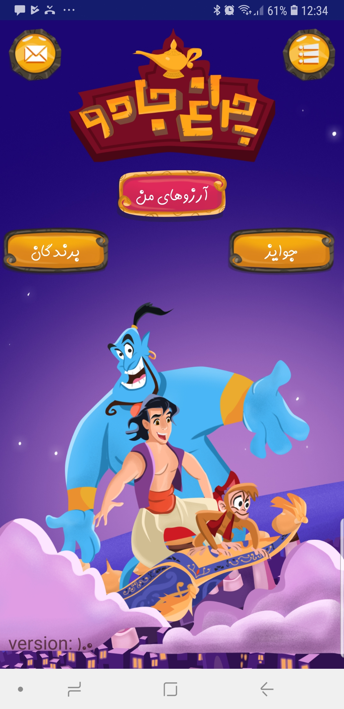

# Alaedin Demo

## Overview
Alaedin is a demo application created to showcase its UI/UX design and functional capabilities in delivering an elegant and seamless user experience. This demo simulates a real-world application environment while providing a glimpse of its potential as a full-fledged product.

## Key Features
- **Modern UI/UX Design**: Intuitive and visually appealing interface for a user-friendly experience.
- **Dynamic Interactions**: Smooth navigation and engaging features that enhance usability.
- **Responsive Design**: Optimized for various device sizes to ensure consistent performance.
- **Customizable Components**: Demonstrates flexibility in adapting to different use cases.

## Purpose
This project is solely for demonstration purposes, showcasing the design and development expertise of the team. It is not intended for production use and does not include live integrations or backend services.

## Screenshots 📸
Here are some screenshots from the application:

### Home Screen

### Support Page

### My Wishes

### Main Menu

### Splash View

## Demo Instructions
1. Clone the repository: `git clone https://github.com/sinakhanjani/alaedin-demo.git`
2. Open the project in your preferred editor.
3. Explore the design and features.

## Feedback
We value your feedback! Please feel free to share your thoughts or suggestions.

---

Thank you for exploring the Alaedin demo!
